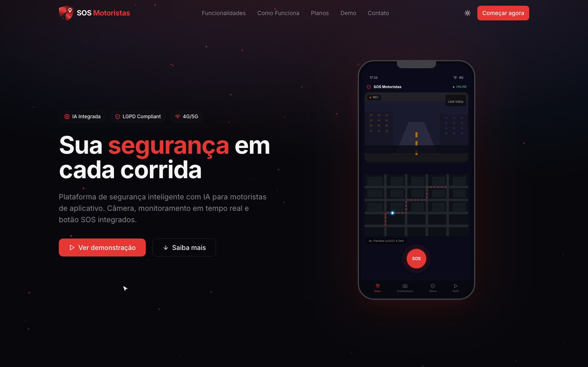

# SOS Motoristas

Aplicação web/PWA com fluxos operacionais e perfis de acesso, integrando interface, dados, mapas e serviços.

## Funcionalidades

- App do motorista com SOS, GPS e alertas
- Central operacional com relatórios e regras por papel
- Landing comercial com Next.js, Prisma e formulário validado

## Tecnologias

React · Vite · PWA · Firebase · Leaflet · OpenAI · MediaPipe Audio

## Acesso

[Abrir site](https://sosmotoristas.com.br)

Esta página apresenta o projeto e suas tecnologias. O código-fonte permanece em repositório privado.

## Contexto da captura

Gravação do site público em produção (sosmotoristas.com.br), incluindo a simulação interativa do próprio site.

Recursos de detecção visual aparecem como simulação de interface; não são recursos de produção validados.

[Voltar ao perfil](../../README.md) · [Conversar sobre um projeto](mailto:caiomoreira47@gmail.com)
