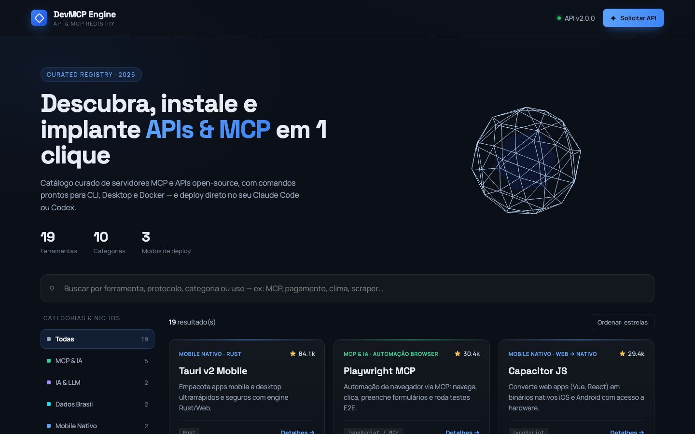

# Catálogo de APIs e MCPs

Catálogo curado de servidores MCP e APIs open-source, com busca, categorias e comandos prontos para CLI, Desktop e Docker.

## Funcionalidades

- Busca e filtros por categoria e nicho
- Instruções de instalação por modo de deploy
- Solicitação de ferramentas com RLS público restrito

## Tecnologias

HTML · CSS · JavaScript · Supabase REST · PostgreSQL

## Acesso

[Abrir site](https://projeto-api-e-mcp.vercel.app)

Esta página apresenta o projeto e suas tecnologias. O código-fonte permanece em repositório privado.

## Contexto da captura

Gravação do catálogo público em produção (Vercel).

[Voltar ao perfil](../../README.md) · [Conversar sobre um projeto](mailto:caiomoreira47@gmail.com)
