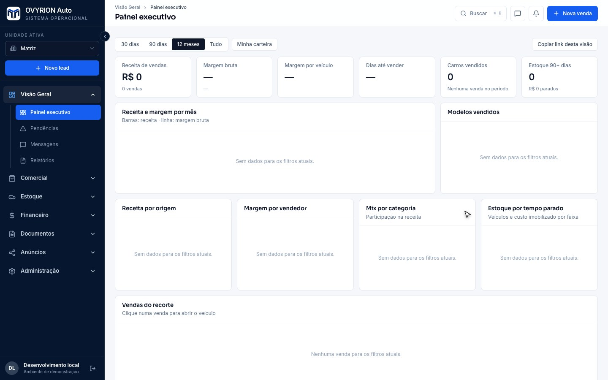

# ERP automotivo e CRM

Plataforma que reúne estoque de veículos, clientes, vendas, finanças, indicadores e comunicação, com isolamento multi-tenant.

## Funcionalidades

- Estoque, vendas, consignação, financeiro, CRM em kanban e BI
- Inbox de WhatsApp e chat em tempo real
- Agentes comerciais com tool use, guardrails e handoff humano
- RLS, RPCs transacionais e isolamento por empresa

## Tecnologias

React · TypeScript · Vite · Express · Supabase · PostgreSQL · Claude SDK · Cloudflare R2

## Acesso

Esta página apresenta o projeto e suas tecnologias. O código-fonte permanece em repositório privado.

## Contexto da captura

Gravação do sistema real rodando no modo local de desenvolvimento, com base vazia: nenhum dado de cliente aparece.

Integrações implementadas em código; provedores live e homologações não foram verificados.

[Voltar ao perfil](../../README.md) · [Conversar sobre um projeto](mailto:caiomoreira47@gmail.com)
