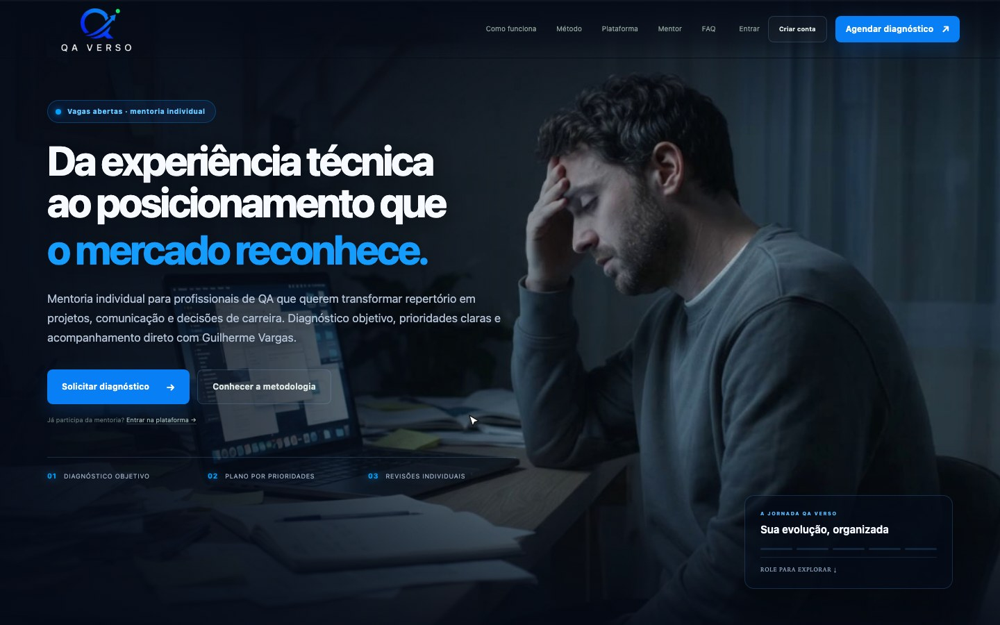

# Plataforma de aprendizagem

Jornadas para alunos, mentores e administradores, com cursos, aulas, materiais, progresso e regras de acesso.

## Funcionalidades

- Portais por perfil: aluno, mentor e admin
- Mídia protegida com upload e playback por tokens assinados
- Integração com Google Drive e Calendar/Meet
- Testes de controle de acesso, JWT e webhooks com Vitest

## Tecnologias

React · Next.js / vinext · TypeScript · Supabase · PostgreSQL · Gemini · Cloudflare R2 · Cloudflare Stream

## Acesso

[Abrir site](https://qaverso.com.br)

Esta página apresenta o projeto e suas tecnologias. O código-fonte permanece em repositório privado.

## Contexto da captura

Gravação do site público em produção (qaverso.com.br). Os portais de aluno, mentor e admin exigem login.

[Voltar ao perfil](../../README.md) · [Conversar sobre um projeto](mailto:caiomoreira47@gmail.com)
