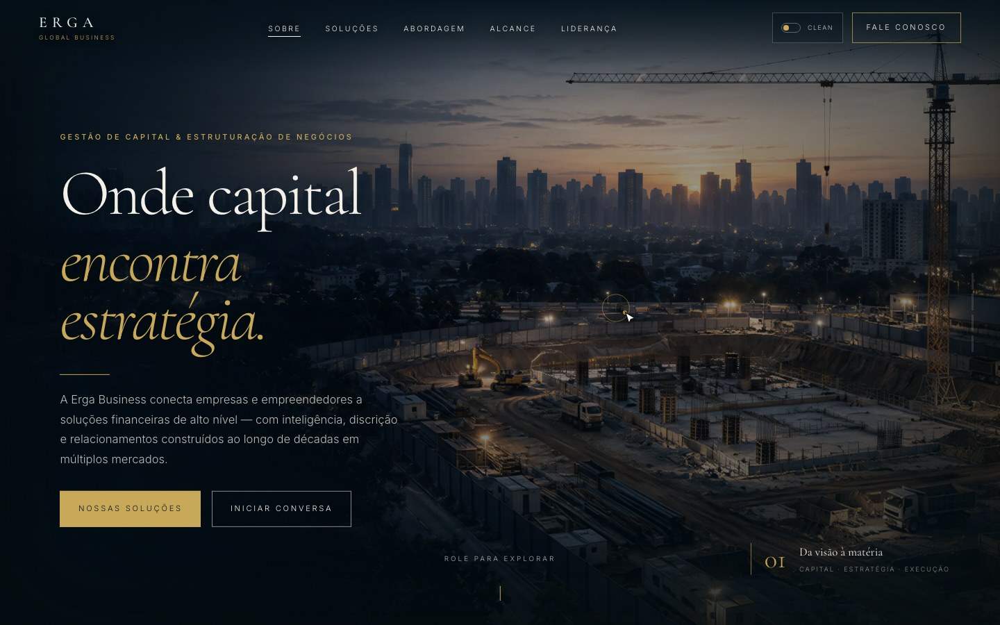

# Erga Business — site cinematográfico

Site institucional em que a rolagem conduz um vídeo sincronizado, com narrativa visual e identidade premium.

## Funcionalidades

- Vídeo sincronizado à rolagem
- Narrativa em etapas com tipografia editorial
- Formulário de contato com persistência

## Tecnologias

Next.js · React · GSAP / ScrollTrigger · Canvas · Prisma

## Acesso

[Abrir site](https://nextjsspace-lac.vercel.app)

Esta página apresenta o projeto e suas tecnologias. O código-fonte permanece em repositório privado.

## Contexto da captura

Gravação do build de produção da experiência ERGA: vídeo sincronizado à rolagem.

[Voltar ao perfil](../../README.md) · [Conversar sobre um projeto](mailto:caiomoreira47@gmail.com)
